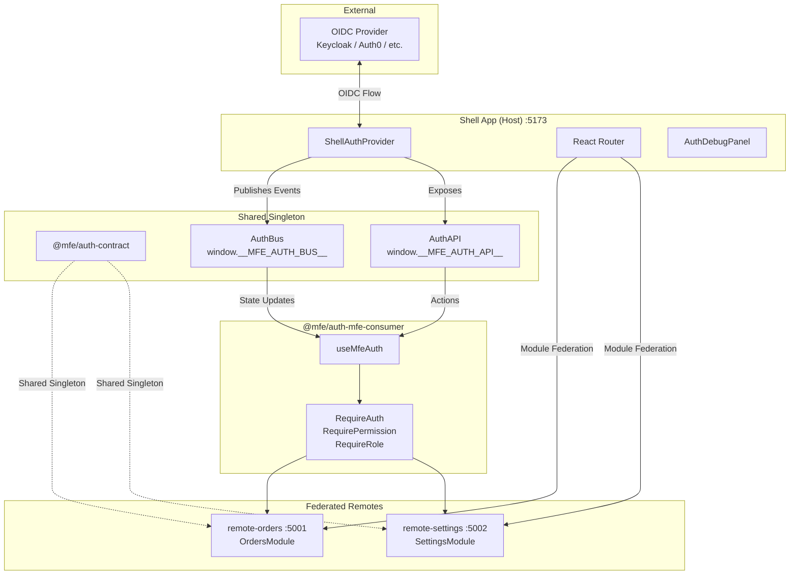

# Architecture Overview

## System Diagram

## How the Pieces Connect

The shell app boots first and mounts `ShellAuthProvider`, which creates an OIDC `UserManager` and checks for an existing session. Every OIDC event (user loaded, token expiring, silent renew error, session expired) is translated into a typed `AuthEvent` and published to the `AuthBus`. The bus validates each state transition through a finite state machine before notifying subscribers.

Remote MFEs are loaded at runtime via `@module-federation/vite`. When a remote mounts, `useMfeAuth()` reads the current state from the bus. If the state is still `UNINITIALIZED` (the shell hasn't finished auth yet), the hook calls `waitForAuth(10_000)` which blocks until `AUTHENTICATED` or times out. Once auth state is available, guard components (`RequireAuth`, `RequirePermission`, `RequireRole`) declaratively control what renders.

The `AuthAPI` on `window.__MFE_AUTH_API__` provides imperative actions — `login()`, `logout()`, `getAccessToken()`, `getAccessTokenSilent()`, and permission/role checks. The `useAuthFetch()` hook wraps the native `fetch` to automatically inject Bearer tokens and retry on 401 with a silent refresh.

All federated modules share a single React instance and a single `@mfe/auth-contract` instance via Module Federation's shared dependency config, ensuring one bus and one state machine across the entire application.

## Key Design Decisions

1. **AuthBus on `window`**: Framework-agnostic event bus allows any MFE technology to participate in auth state. The bus is a shared singleton via `@mfe/auth-contract`.

2. **State Machine**: Strict state transitions prevent impossible auth states and make debugging predictable.

3. **Shell owns OIDC**: Only the shell interacts with the OIDC provider. MFEs consume auth state through the bus, keeping them lightweight.

4. **Module Federation via `@module-federation/vite`**: Official MF 2.0 Vite plugin with shared dependency deduplication, cross-bundler interop, and dev-mode HMR.

5. **One-way data flow**: Auth state flows from shell → bus → remotes. Remotes never write auth state directly — they request actions via the AuthAPI, and the shell publishes resulting state changes.
