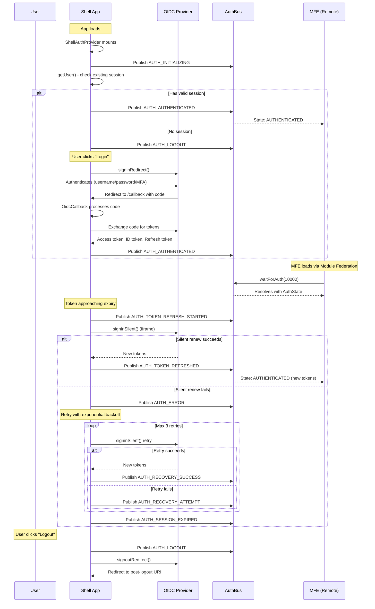

# Authentication Flow

## OIDC Sequence Diagram

```mermaid
sequenceDiagram
    participant User
    participant Shell as Shell App
    participant OIDC as OIDC Provider
    participant Bus as AuthBus
    participant MFE as MFE (Remote)

    Note over Shell: App loads
    Shell->>Shell: ShellAuthProvider mounts
    Shell->>Bus: Publish AUTH_INITIALIZING
    Shell->>Shell: getUser() - check existing session

    alt Has valid session
        Shell->>Bus: Publish AUTH_AUTHENTICATED
        Bus-->>MFE: State: AUTHENTICATED
    else No session
        Shell->>Bus: Publish AUTH_LOGOUT
        Note over Shell: User clicks "Login"
        Shell->>OIDC: signinRedirect()
        User->>OIDC: Authenticates (username/password/MFA)
        OIDC->>Shell: Redirect to /callback with code
        Shell->>Shell: OidcCallback processes code
        Shell->>OIDC: Exchange code for tokens
        OIDC-->>Shell: Access token, ID token, Refresh token
        Shell->>Bus: Publish AUTH_AUTHENTICATED
    end

    Note over MFE: MFE loads via Module Federation
    MFE->>Bus: waitForAuth(10000)
    Bus-->>MFE: Resolves with AuthState

    Note over Shell: Token approaching expiry
    Shell->>Bus: Publish AUTH_TOKEN_REFRESH_STARTED
    Shell->>OIDC: signinSilent() (iframe)

    alt Silent renew succeeds
        OIDC-->>Shell: New tokens
        Shell->>Bus: Publish AUTH_TOKEN_REFRESHED
        Bus-->>MFE: State: AUTHENTICATED (new tokens)
    else Silent renew fails
        Shell->>Bus: Publish AUTH_ERROR
        Note over Shell: Retry with exponential backoff
        loop Max 3 retries
            Shell->>OIDC: signinSilent() retry
            alt Retry succeeds
                OIDC-->>Shell: New tokens
                Shell->>Bus: Publish AUTH_RECOVERY_SUCCESS
            else Retry fails
                Shell->>Bus: Publish AUTH_RECOVERY_ATTEMPT
            end
        end
        Shell->>Bus: Publish AUTH_SESSION_EXPIRED
    end

    Note over User: User clicks "Logout"
    Shell->>Bus: Publish AUTH_LOGOUT
    Shell->>OIDC: signoutRedirect()
    OIDC-->>Shell: Redirect to post-logout URI
```
