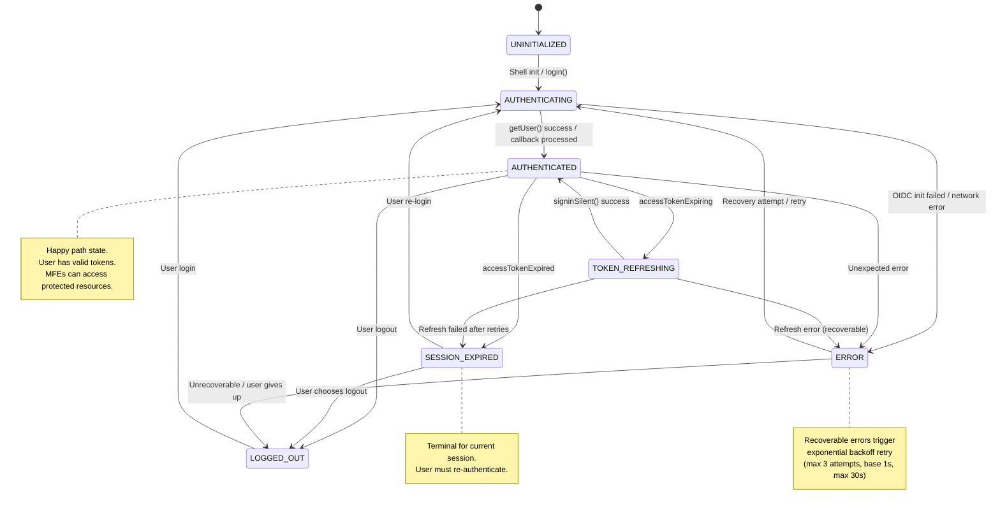

# Auth State Machine

## State Diagram

## Transition Table

| From | To | Trigger |
|------|-----|---------|
| UNINITIALIZED | AUTHENTICATING | Shell init, login() call |
| AUTHENTICATING | AUTHENTICATED | Successful auth |
| AUTHENTICATING | ERROR | Auth failure |
| AUTHENTICATED | TOKEN_REFRESHING | Token expiring event |
| AUTHENTICATED | SESSION_EXPIRED | Token expired event |
| AUTHENTICATED | LOGGED_OUT | User logout |
| AUTHENTICATED | ERROR | Unexpected error |
| TOKEN_REFRESHING | AUTHENTICATED | Silent renew success |
| TOKEN_REFRESHING | SESSION_EXPIRED | Renew failed after retries |
| TOKEN_REFRESHING | ERROR | Renew error |
| SESSION_EXPIRED | AUTHENTICATING | Re-login attempt |
| SESSION_EXPIRED | LOGGED_OUT | User chooses logout |
| ERROR | AUTHENTICATING | Recovery/retry |
| ERROR | LOGGED_OUT | Give up |
| LOGGED_OUT | AUTHENTICATING | New login |
